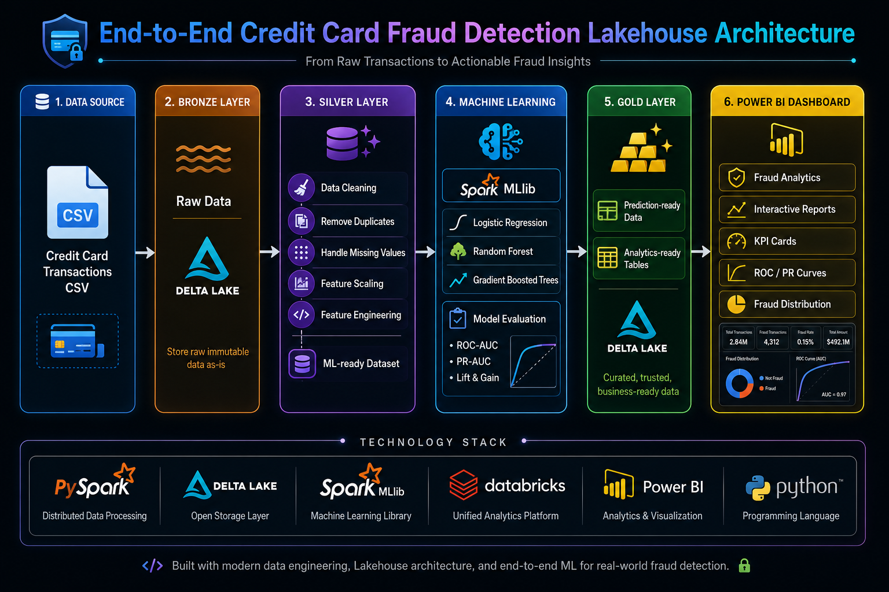
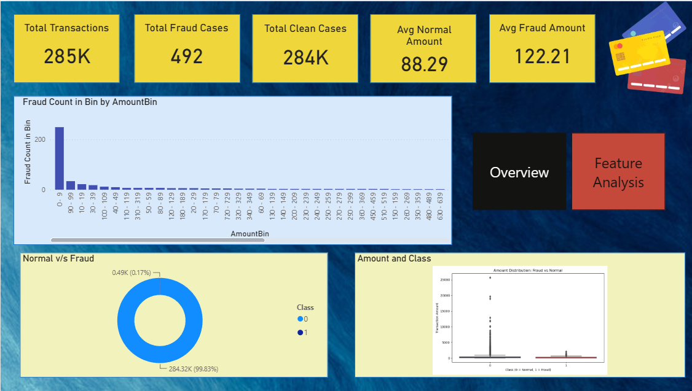
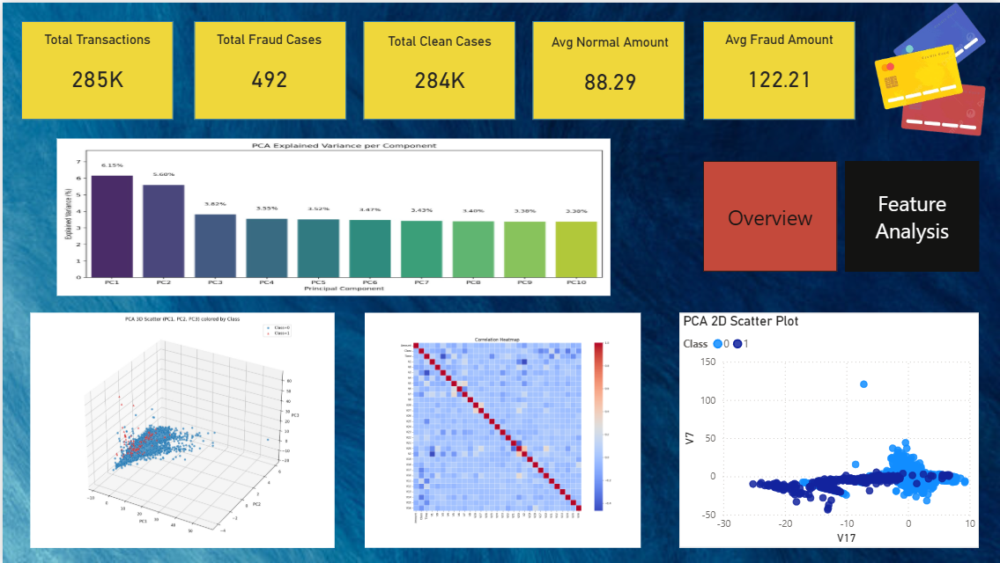

# 💳 Credit Card Fraud Detection Data Warehouse

> An end-to-end **Big Data Fraud Detection Pipeline** built using **PySpark**, **Delta Lake**, **Spark MLlib**, and **Power BI**, implementing the **Medallion (Bronze–Silver–Gold) Architecture** for scalable data engineering, machine learning, and business analytics.

---

## 🚀 Project Overview

This project demonstrates the complete lifecycle of a fraud detection system—from raw transaction ingestion to interactive business dashboards.

The pipeline follows the **Lakehouse / Medallion Architecture**:

- 🥉 **Bronze Layer** – Raw transaction data ingestion
- 🥈 **Silver Layer** – Data cleaning, preprocessing, scaling, and feature engineering
- 🥇 **Gold Layer** – Machine Learning predictions and analytics-ready data

The processed data is used to train multiple machine learning models and visualize fraud insights through Power BI dashboards.

---

## 🏗️ Architecture

<p align="center">
  
</p>

---

# ⚙️ Technology Stack

| Category | Technologies |
|-----------|--------------|
| Language | Python, PySpark |
| Big Data | Apache Spark |
| Data Storage | Delta Lake |
| Architecture | Medallion (Bronze–Silver–Gold) |
| Machine Learning | Spark MLlib |
| Visualization | Power BI |
| Libraries | Matplotlib, Scikit-learn |

---

# 📊 Dataset

- **Dataset:** Credit Card Fraud Detection
- **Total Transactions:** 284,807
- **Fraud Cases:** 492
- **Features:** PCA-transformed features (V1–V28), Time, Amount
- **Target Variable:** Class (0 = Normal, 1 = Fraud)

---

# 🔄 Data Pipeline

### 🥉 Bronze Layer
- Raw CSV ingestion
- Schema inference
- Initial storage

### 🥈 Silver Layer
- Remove duplicate records
- Handle missing values
- Feature scaling (Time & Amount)
- Feature vector creation
- Class weight calculation
- ML-ready dataset generation

### 🥇 Gold Layer
- Fraud prediction results
- Model evaluation metrics
- Analytics-ready tables
- Dashboard integration

---

# 🤖 Machine Learning Models

- Logistic Regression
- Random Forest Classifier
- Gradient Boosted Trees (GBT)

---

# 📈 Model Evaluation

The models were evaluated using:

- ROC Curve
- Precision–Recall Curve
- AUROC
- AUPRC
- Confusion Matrix
- Lift Chart
- Gain Chart

---

# 📊 Power BI Dashboard

The dashboard provides:

- Fraud Overview
- Transaction Distribution
- Time-based Fraud Analysis
- Amount Distribution
- Fraud Percentage
- PCA Visualizations
- Business Insights

<p align="center">
  
</p>
<p align="center">
  
</p>

---

# ✨ Key Features

- End-to-End Data Engineering Pipeline
- Medallion Architecture Implementation
- Delta Lake Storage
- Distributed Data Processing using Spark
- Machine Learning with Spark MLlib
- Fraud Detection Analytics
- Interactive Power BI Dashboard
- Business Intelligence Reporting

---

# 📌 Workflow

```
Raw Credit Card Dataset
            │
            ▼
      Bronze Layer
            │
            ▼
 Data Cleaning & Validation
            │
            ▼
      Silver Layer
            │
            ▼
 Feature Engineering
            │
            ▼
 Machine Learning Models
            │
            ▼
      Gold Layer
            │
            ▼
   Power BI Dashboard
```
---

# 🏆 Highlights

- Implemented a scalable **Lakehouse Architecture**
- Processed **284K+** credit card transactions
- Built a complete ETL pipeline using PySpark
- Compared multiple Spark ML models
- Developed interactive business dashboards in Power BI
- Generated analytics-ready Delta tables

---


## 👩‍💻 Author

**Ananya**
